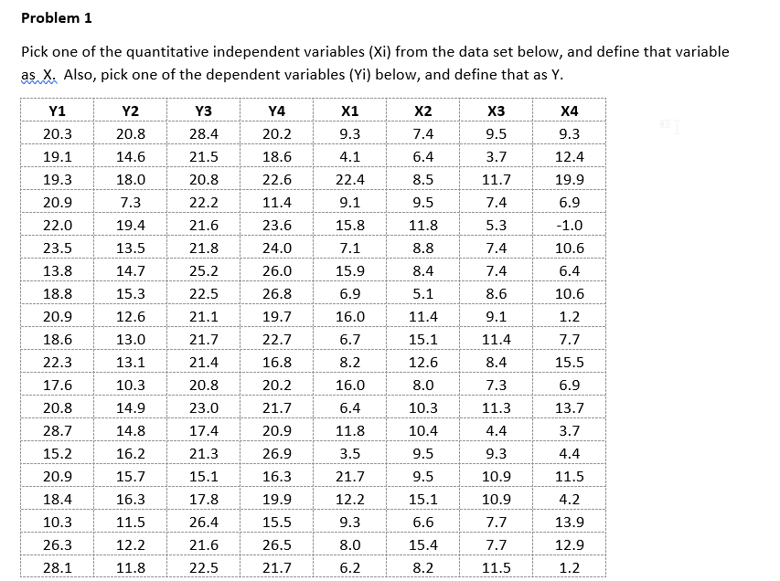
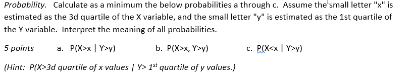
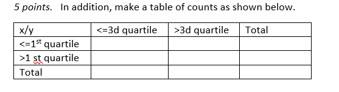
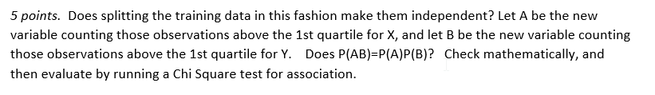
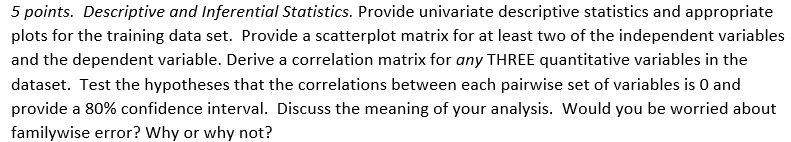
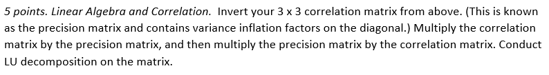
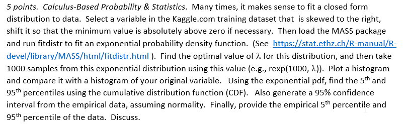

```{r setup, include=FALSE}
knitr::opts_chunk$set(echo = FALSE)
knitr::opts_chunk$set(tidy = TRUE)
knitr::opts_chunk$set(warning = FALSE)

loadPkg <- function(x) {
  if(!require(x, character.only = T)) install.packages(x, dependencies = T, repos = "http://cran.us.r-project.org")
  require(x, character.only = T)
}

libs <- c("knitr", "magrittr", "data.table", "kableExtra", "tidyverse", "matlib", "combinat", "leaps", "dummies", "rootSolve", "Deriv", "pracma", "MASS", "fBasics", "GGally", "missForest")

lapply(libs, loadPkg)
```

## Problem 1


I chose to use X4 and Y4
```{r, echo = FALSE}
data <- data.frame(x4 = c(9.3,12.4,19.9,6.9,-1,10.6,6.4,10.6,1.2,7.7,15.5,6.9,13.7,3.7,4.4,11.5,4.2,13.9,12.9,1.2),
                   y4 = c(20.2,18.6,22.6,11.4,23.6,24,26,26.8,19.7,22.7,16.8,20.2,21.7,20.9,26.9,16.3,19.9,15.5,26.5,21.7))
```

```{r}
x.quantile1 <- quantile(data$x4, .25)
x.quantile3 <- quantile(data$x4, .75)
y.quantile1 <- quantile(data$y4, .25)

# probability table for Xgtx and Ygty
probs <- data %>%
  transmute(Xgtx = ifelse(x4 > x.quantile3, 1, 0),
            Ygty = ifelse(y4 > y.quantile1, 1, 0))

# marginal probabilities
# P(X > x)
Xgtx <- sum(probs$Xgtx)/nrow(probs)

# P(X <= x)
Xlex <- sum(probs$Xgtx == 0)/nrow(probs)

# P(X < x)
Xltx <- sum(data$x4 < x.quantile3)/nrow(data)

# P(Y > y)
Ygty <- sum(probs$Ygty)/nrow(probs)

# P(Y <= y)
Yley <- sum(probs$Ygty == 0)/nrow(probs)

# joint probabilites
Xgtx_Ygty <- sum(probs$Xgtx == 1 & probs$Ygty == 1)/nrow(probs)
Xlex_Yley <- sum(probs$Xgtx == 0 & probs$Ygty == 0)/nrow(probs)
Xltx_Ygty <- sum(data$x4 < x.quantile3 & data$y4 > y.quantile1)/nrow(data)
Xlex_Ygty <- sum(data$x4 <= x.quantile3 & data$y4 > y.quantile1)/nrow(data)
```

### 1.1


#### 1.1.a
$$P(X > x | Y > y) \\
\frac{P(X , Y)}{P(Y)}
$$
The above reads as the probability that an X value is greater than the 3rd quartile of the X values given that the Y value is greater than the 1st quartile of the Y values

```{r}
Xgtx_Ygty/Ygty
```

This means that when Y values are greater than the 1st quartile of Y, there is a 20% chance that the X is greater than the 3rd quartile of X

#### 1.1.b
$P(X > x, Y > y)$

The above read as the probability that when X is greater than the 3rd quartile of X, Y is also greater than the 1st quartile of Y

```{r}
Xgtx_Ygty
```

The probability of both of these events occuring is 15%

#### 1.1.c
$$P(X < x | Y > y) \\
\frac{P(X, Y)}{P(Y)}
$$
The above reads as the probability that X is less than the 3rd quartile of X, given that Y is > than the 1st quartile of Y

```{r}
Xltx_Ygty/Ygty
```

This means that there is an 80% probability that when Y is greater than the 1st quartile of Y, X is less than the 3rd quartile of X

I am adding the below just in case the probability was supposed to read less than or equal to
$P(X \leq x | Y > y)$

```{r}
Xlex_Ygty/Ygty
```

There is also an 80% chance of this occuring

### 1.2


```{r}
Xgtx_Yley <- sum(data$x4 > x.quantile3 & data$y4 <= y.quantile1)/nrow(data)

tbl_counts <- data.frame(
  'x/y' = c('Y<=y', 'Y>y', 'Total'),
            'X<=x' = c(Xlex_Yley, Xlex_Ygty, Xlex_Yley + Xlex_Ygty),
            'X>x' = c(Xgtx_Yley, Xgtx_Ygty, Xgtx_Yley + Xgtx_Ygty),
            Total = c(Xlex_Yley + Xgtx_Yley, Xlex_Ygty + Xgtx_Ygty, Xlex_Yley + Xlex_Ygty + Xgtx_Yley + Xgtx_Ygty)) 

names(tbl_counts) <- c('X/Y', 'X<=x', 'X>x', 'Total')

tbl_counts %>% print


```


### 1.3


```{r}
A <- data %>% dplyr::filter(x4 > x.quantile1)
B <- data %>% dplyr::filter(y4 > y.quantile1)
PA <- nrow(A)/nrow(data)
PB <- nrow(B)/nrow(data)

AB <- data %>% dplyr::filter(x4 > x.quantile1 & y4 > y.quantile1)
PAB <- nrow(AB)/nrow(data)
```

```{r}
# P(AB) = P(A) * P(B)
data_frame(PAB = c(PA), PA_PB = c(PA * PB), Eq = (PAB == PA * PB))
```

```{r}
xleq1_yleq1 <- data %>% dplyr::filter(x4 <= x.quantile1 & y4 <= y.quantile1) %>% nrow()
xleq1_ygtq1 <- data %>% dplyr::filter(x4 <= x.quantile1 & y4 > y.quantile1) %>% nrow()
xgtq1_yleq1 <- data %>% dplyr::filter(x4 > x.quantile1 & y4 <= y.quantile1) %>% nrow()
xgtq1_ygtq1 <- data %>% dplyr::filter(x4 > x.quantile1 & y4 > y.quantile1) %>% nrow()

test <- data.frame(c(xleq1_yleq1, xleq1_ygtq1), c(xgtq1_yleq1, xgtq1_ygtq1)) %>% data.matrix()

# chi-sq test
chisq.test(test, correct = T)
```

The chi-square test's p-value of .3711 shows that we X & Y are not independent due to the failure to reach significance at .05. 

## Problem 2
```{r}
train <- read_csv("./data/train.csv") %>%
  as.data.frame()
test <- read_csv("./data/test.csv") %>%
  as.data.frame()
```

### 2a 


#### EDA
```{r}
train %>%
  select_if(is.numeric) %>%
  as.data.frame() %>%
  basicStats()
```


#### Correlation
```{r}
train %>%
  select_if(is.numeric) %>%
  cor(use = "na.or.complete") %>%
  as.data.frame() %>%
  rownames_to_column(var = "predictor") %>%
  as_data_frame() %>%
  dplyr::select(predictor, SalePrice) %>%
  arrange(desc(SalePrice)) %>%
  head()

train %>%
  select_if(is.numeric) %>%
  cor(use = "na.or.complete") %>%
  as.data.frame() %>%
  rownames_to_column(var = "predictor") %>%
  as_data_frame() %>%
  dplyr::select(predictor, SalePrice) %>%
  arrange(SalePrice) %>%
  head()
```

Most correlated variables
- OverallQual, GrLivArea, GarageCars are the most highly correlated variables with SalePrice

#### Correlation Matrix
```{r}
corDF <- train %>%
  dplyr::select(SalePrice, OverallQual, GrLivArea) %>%
  cor(use = "complete.obs") %>%
  print
```


#### Scatterplot Matrix
```{r}
train %>%
  dplyr::select(SalePrice, OverallQual, GrLivArea, GarageCars) %>%
  ggpairs()
```

#### Hypothesis Test

##### GrLivArea & Saleprice
```{r}
cor.test(train$GrLivArea, train$SalePrice, method = "pearson", conf.level = .8)
```

- The correlation between GrLivArea and SalePrice is not zero and the test shows the correlation to be ~.7086 and the p-value is very small showing statistical significance and thereby rejecting the null hypothesis
- The confidence interval for GrLivArea and SalePrice is ~.6915 - .7249


##### GarageCars & Saleprice
```{r}
cor.test(train$GarageCars, train$SalePrice, method = "pearson", conf.level = .8)
```

- The correlation between GarageCars and SalePrice is not zero and the test shows the correlation to be ~.6404 and the p-value is very small showing statistical significance and thereby rejecting the null hypothesis
- The confidence interval for GarageCars and SalePrice is ~.6202 - .6598


##### OverallQual & Saleprice
```{r}
cor.test(train$OverallQual, train$SalePrice, method = "pearson", conf.level = .8)
```

- The correlation between OverallQual and SalePrice is not zero and the test shows the correlation to be ~.7910 and the p-value is very small showing statistical significance and thereby rejecting the null hypothesis
- The confidence interval for OverallQual and SalePrice is ~.7781 - .8032

#### Family-Wise Error
```{r}
1 - (1 - .2)^3
```

I am worried about a family-wise error given that the FWER is .488 very close to a 50% chance


### 2b


#### Invert Correlation Matrix
```{r}
i.corDF <- t(corDF) %>%
  print
```

#### Multiply by Precision Matrix
```{r}
corDF %*% i.corDF
```

```{r}
i.corDF %*% corDF
```

#### LU Decomposition
```{r}
lu.m <- i.corDF %*% corDF
lu(lu.m, scheme = "ijk")
```


### 2c

```{r}
min(train$LotArea)
```


```{r}
lot.a.vec <- train$LotArea - min(train$LotArea) + .000000001
min(lot.a.vec)
```

#### Fitdistr
```{r}
fit.d <- fitdistr(lot.a.vec, "exponential")
lambda <- fit.d$estimate %>%
  print
```

```{r}
samples <- rexp(1000, lambda)
```

```{r}
qplot(samples, main = "Simulated")
qplot(lot.a.vec, main = "Actual")
```

#### CDF 5, 95%
```{r}
cdf5 <- (log(.95)/-lambda) %>%
  print

cdf95 <- (log(.05)/-lambda) %>%
  print
```

#### Empirical 5, 95%
```{r}
emp5 <- quantile(lot.a.vec, .05) %>%
  print
emp95 <- quantile(lot.a.vec, .95) %>%
  print
```

#### Confidence Interval
```{r}
ci <- t.test(lot.a.vec)$conf.int[1:2] %>%
  print
```

#### Summary Table
```{r}
data_frame(name = c('Sim', 'Emp', 'CI'),
           p5 = c(cdf5, emp5, ci[1]),
           p95 = c(cdf95, emp95, ci[2]))
```

The exponential distribution does not do a good job of estimating the actual data. The discrepancies/variance between the percentiles is vast. The bootstrapped confidence interval is a better estimator although still far from perfect.


### 2d


#### Clean Dataset
```{r}
dfs <- list(train, test)

clean.dummies <- function(df) {
  # drop id column
  df <- df %>%
    dplyr::select(-1) %>%
    # select only numeric columns
    dplyr::select_if(is.numeric)
  
  # impute missing values
  forest <- df %>%
    missForest()
  
  df <- forest$ximp
  
  return(df)
}

newDfs <- dfs %>%
  map(~ clean.dummies(.x))
```

#### Regression Subsetting
```{r}
regDiags <- regsubsets(SalePrice ~ ., data = newDfs[[1]], method = "exhaustive", nvmax = NULL, nbest = 1, really.big = T)
diagSum <- summary(regDiags)
print(diagSum)

```

```{r}
# determine best fits
plot(diagSum$cp, xlab = "Number of Variables", ylab = "Cp")
points(which.min(diagSum$cp), diagSum$cp[which.min(diagSum$cp)], pch = 20, col = "red")

diagSum$which[20,]
```

#### Model
```{r}
model <- lm(SalePrice ~ MSSubClass + LotFrontage + LotArea + OverallQual + OverallCond + YearBuilt + YearRemodAdd + MasVnrArea + BsmtFinSF1 + TotalBsmtSF + GrLivArea + BsmtFullBath + FullBath + BedroomAbvGr + KitchenAbvGr + TotRmsAbvGrd + Fireplaces + GarageCars + WoodDeckSF + ScreenPorch, data = dfs[[1]])
summary(model)
```


#### Evaluation
```{r}
par(mfrow=c(2,2))

plot(model)
hist(model$residuals)
qqnorm(model$residuals)
qqline(model$residuals)
```

The diagnostic plots show that a linear regression was appropriate. This model is able to account for .8077 or ~81% of the variation

#### Predict

```{r}
pred <- predict(model, dfs[[1]])
qplot(train$SalePrice, pred, xlab = 'Actual', ylab = 'Predicted')
pred[is.na(pred)] = mean(pred, na.rm = T)
```

Overall, the model does a good job of predicting the SalePrice with the exception of a few outliers

```{r}
dfs[[2]]$SalePrice <- predict(model, dfs[[2]], type = "response")

sub.df <- dfs[[2]] %>%
  dplyr::select(Id, SalePrice)
sub.df$SalePrice[is.na(sub.df$SalePrice)] = mean(sub.df$SalePrice, na.rm = T)

#write_csv(sub.df, path = "submission.csv")
```

#### Kaggle

Username: https://www.kaggle.com/baroncurtin2
Score: .24747

#### Youtube
https://youtu.be/5GBR9wOAdQE
