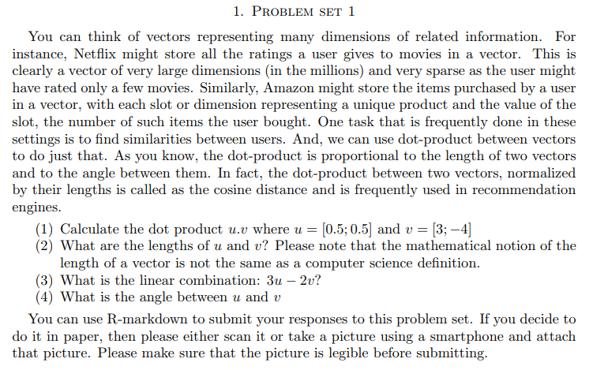
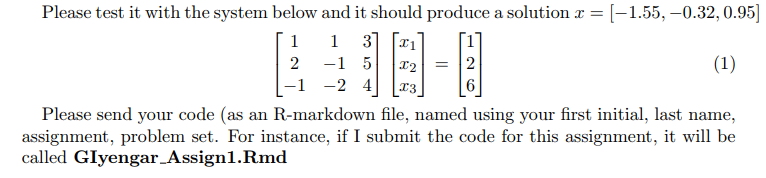

```{r setup, include=FALSE}
knitr::opts_chunk$set(echo = FALSE)
knitr::opts_chunk$set(tidy = TRUE)
knitr::opts_chunk$set(warning = FALSE)

loadPkg <- function(x) {
  if(!require(x, character.only = T)) install.packages(x, dependencies = T, repos = "http://cran.us.r-project.org")
  require(x, character.only = T)
}

libs <- c("knitr", "magrittr", "data.table", "kableExtra", "tidyverse")

lapply(libs, loadPkg)
```


## 1


1)
```{r}
u <- c(.5, .5)
v <- c(3, -4)

dp <- (u %*% v) %>%
  print
```

2)
```{r}
lenVector <- function(x) sqrt(x %*% x)

lov.u <- lenVector(u)
lov.v <- lenVector(v)

data_frame(lov.u = c(lov.u), lov.v = c(lov.v))
```

3)
```{r}
lc <- (3*u - 2*v) %>%
  print
```

4)
```{r}
angle <- acos(dp / (lov.u * lov.v)) %>%
  multiply_by(180/pi) %>%
  print
```


## 2




```{r}
mySolve <- function(m, v) {
  # combine matrix and vector
  m <- cbind(m, v)

  # set [2, 1] to 0
  one <- m[2,1] / m[1,1]
  m[2,] <- m[2,] - (m[1,] * one)

  # set [3,1] to 0
  two <- m[3, 1] / m[1, 1]
  m[3,] <- m[3,] - (m[1,] * two)

  # set [3,2] to 0
  three <- m[3, 2] / m[2,2]
  m[3,] <- m[3,] - (m[2,] * three)

  # solve
  x3 <- m[3, 4] / m[3, 3]
  x2 <- (m[2, 4] - (m[2, 3] * x3)) / m[2, 2]
  x1 <- (m[1, 4] - (m[1, 3] * x3) - (m[1, 2] * x2)) / m[1, 1]

  m <- matrix(c(x1, x2, x3), nrow = 3)
  return(round(m, 2))
}
```

```{r testcase}
m <- matrix(c(1, 2, -1, 1, -1, -2, 3, 5, 4), nrow=3, ncol=3)
v <- c(1, 2, 6)

mySolve(m, v)
```


