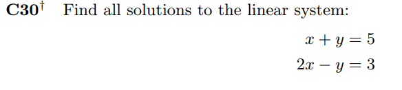

```{r setup, include=FALSE}
knitr::opts_chunk$set(echo = FALSE)
knitr::opts_chunk$set(tidy = TRUE)
knitr::opts_chunk$set(warning = FALSE)

loadPkg <- function(x) {
  if(!require(x, character.only = T)) install.packages(x, dependencies = T, repos = "http://cran.us.r-project.org")
  require(x, character.only = T)
}

libs <- c("knitr", "magrittr", "data.table", "kableExtra", "tidyverse")

lapply(libs, loadPkg)
```


## 1


1)
```{r}
m <- matrix(c(1, 2, 1, -1), nrow = 2, ncol = 2)
v <- c(5, 3)

round(solve(m, v), 2)
```