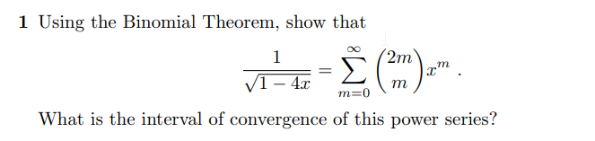

```{r setup, include=FALSE}
knitr::opts_chunk$set(echo = FALSE)
knitr::opts_chunk$set(tidy = TRUE)
knitr::opts_chunk$set(warning = FALSE)

loadPkg <- function(x) {
  if(!require(x, character.only = T)) install.packages(x, dependencies = T, repos = "http://cran.us.r-project.org")
  require(x, character.only = T)
}

libs <- c("knitr", "magrittr", "data.table", "kableExtra", "tidyverse", "matlib", "combinat")

lapply(libs, loadPkg)
```

## Question 1


```{r}
f <- function(x) {
  return(1/sqrt(1 - (4*x)))
}

N = -1:-100

plot(N, f(N), type='l', lwd=2)
```

There is no obvious conversion
