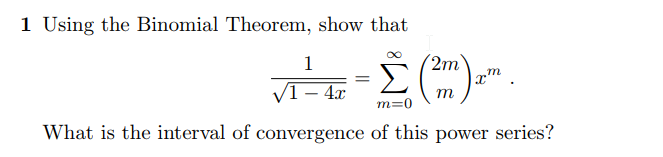

```{r setup, include=FALSE}
knitr::opts_chunk$set(echo = FALSE)
knitr::opts_chunk$set(tidy = TRUE)
knitr::opts_chunk$set(warning = FALSE)

loadPkg <- function(x) {
  if(!require(x, character.only = T)) install.packages(x, dependencies = T, repos = "http://cran.us.r-project.org")
  require(x, character.only = T)
}

libs <- c("knitr", "magrittr", "data.table", "kableExtra", "tidyverse", "matlib", "combinat")

lapply(libs, loadPkg)
```

## Question 1



```{r}
p = .4
q = .6
N = 8

sim <- function(i) {
  round((1-(q/p)^i)/(1-(q/p)^N), 4)
}

Ps <- data_frame(i = 0:N) %>%
  mutate(P = sim(i)) %>%
  print
```

a) Timid Strategy
```{r}
Ps[Ps$i == 1, ]
```

b) Bold Strategy
```{r}
.4^3
```

c) The bold strategy gives Smith the better chance of getting out of jail at .064 when compared to .0203 of the timid strategy. That is a `r (.064 - .0203) * 100`% better chance

