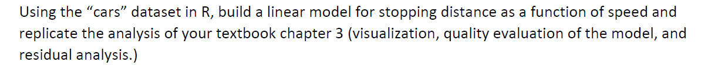

```{r setup, include=FALSE}
knitr::opts_chunk$set(echo = FALSE)
knitr::opts_chunk$set(tidy = TRUE)
knitr::opts_chunk$set(warning = FALSE)

loadPkg <- function(x) {
  if(!require(x, character.only = T)) install.packages(x, dependencies = T, repos = "http://cran.us.r-project.org")
  require(x, character.only = T)
}

libs <- c("knitr", "magrittr", "data.table", "kableExtra", "tidyverse", "matlib", "combinat", "leaps", "dummies")

lapply(libs, loadPkg)
```

## Question 1


```{r}
data("cars")
```


Generate Model

```{r}
model <- lm(dist ~ ., data = cars)
summary(model)
```

Evaluation
```{r}
par(mfrow=c(2,2))

plot(model)
hist(model$residuals)
qqnorm(model$residuals)
qqline(model$residuals)
```

The residuals of the model are slightly skewed right but apporximately normal. The normal plot shows residuals that follow a normal approximation. The model only has an R^2 of .6438 which means that the speed only accounts for ~64% of the variation when it comes to stopping distance. A better model would likely include more features.