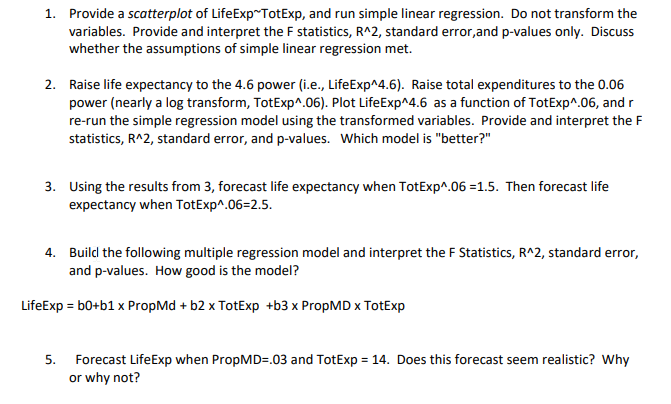

```{r setup, include=FALSE}
knitr::opts_chunk$set(echo = FALSE)
knitr::opts_chunk$set(tidy = TRUE)
knitr::opts_chunk$set(warning = FALSE)

loadPkg <- function(x) {
  if(!require(x, character.only = T)) install.packages(x, dependencies = T, repos = "http://cran.us.r-project.org")
  require(x, character.only = T)
}

libs <- c("knitr", "magrittr", "data.table", "kableExtra", "tidyverse", "matlib", "combinat", "leaps", "dummies")

lapply(libs, loadPkg)
```

```{r}
data <- "who.csv" %>%
  read_csv()
```




## 1
```{r}
m1 <- lm(LifeExp ~ TotExp, data=data)
summary(m1)
plot(m1)

ggplot(data, aes(x = TotExp, y = LifeExp)) +
  geom_point() +
  geom_smooth(method = "lm") +
  labs(x = "Total Expenditures", y = "Avg Life Expectancy (Years)")
```

  - P-Value: Suggest statistical significance due to the pvalue being less than .05
  - F-Statistic: Suggests that adding the variable TotExp improves the model when compared to only the intercept
  - Standard Error: Shows that the residuals are normally distributed within +- 9.371 year
  - R^2: Only 25.37% of the variability is explained by the model and thus is not that great predictor of LifeExp

## 2
```{r}
data2 <- data %>%
  mutate(LifeExp = LifeExp ^ 4.6,
         TotExp = TotExp ^ .06)

m2 <- lm(LifeExp ~ TotExp, data=data2)
summary(m2)
plot(m2)

ggplot(data2, aes(x = TotExp, y = LifeExp)) +
  geom_point() +
  geom_smooth(method = "lm") +
  labs(x = "Total Expenditures", y = "Avg Life Expectancy (Years)")
```

  - P-Value: Suggest statistical significance due to the pvalue being less than .05
  - F-Statistic: Suggests that adding the variable TotExp improves the model when compared to only the intercept and is better than the first model
  - Standard Error: Shows that the residuals are normally distributed within +- 9049000^4.6 year
  - R^2: 72.98% of the variability is explained by the model and thus is a better predictor of LifeExp
  
## 3
```{r}
predict(m2, newdata = data.frame(TotExp = c(1.5, 2.5)), interval = "predict")^(1/4.6)
```

## 4
```{r}
m4 <- lm(LifeExp ~ PropMD + TotExp + PropMD * TotExp, data=data)
summary(m4)
plot(m4)
hist(resid(m4))
```

  - P-Value: Suggest statistical significance on all variables due to the pvalue being less than .05
  - F-Statistic: Suggests that adding the variables improves the model when compared to only the intercept, however there is a penalty for adding variables
  - Standard Error: Shows that the residuals are normally distributed within +- 8.765 year
  - R^2: Only 34.49% of the variability is explained by the model and thus is not that great predictor of LifeExp
  - Conclusion: Better than Model1 but not better than Model2, however the model is not viable because the residuals are skewed left
  
## 5
```{r}
predict(m4, newdata = data.frame(PropMD = c(.03), TotExp = c(14)), interval = "predict")
```

A life expectancy of 107 nearly 108 years seems unlikely. Not many people live that long, but maybe if there are more doctors in the country, there are people that can treat the normal ailments that come with age.