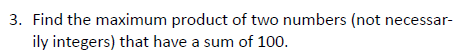

```{r setup, include=FALSE}
knitr::opts_chunk$set(echo = FALSE)
knitr::opts_chunk$set(tidy = TRUE)
knitr::opts_chunk$set(warning = FALSE)

loadPkg <- function(x) {
  if(!require(x, character.only = T)) install.packages(x, dependencies = T, repos = "http://cran.us.r-project.org")
  require(x, character.only = T)
}

libs <- c("knitr", "magrittr", "data.table", "kableExtra", "tidyverse", "matlib", "combinat", "leaps", "dummies", "rootSolve")

lapply(libs, loadPkg)
```

## Question 4.3.3



$$x + z = 100$$
$$z = 100 - x$$
$$y = x z$$

$$y = x(100 - x)$$
$$x = 100x - x^2$$


```{r}
y = expression(100 * x - x^2)
y.i = D(y, 'x')

print(y.i)
```

$$y' = 100 - 2x$$
$$x = 50$$
$$y = 50$$

