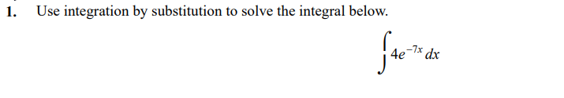
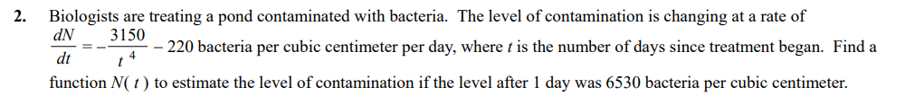
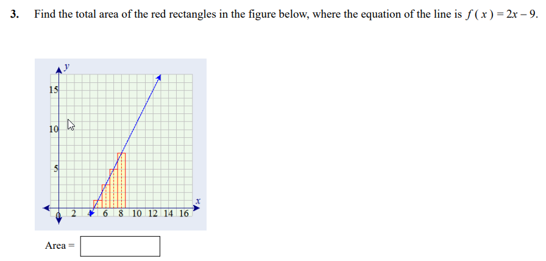
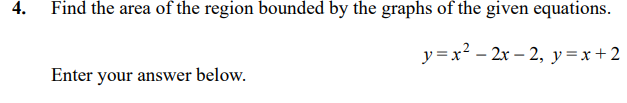
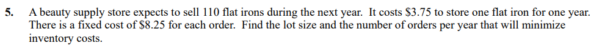
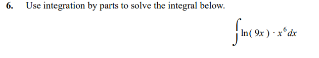
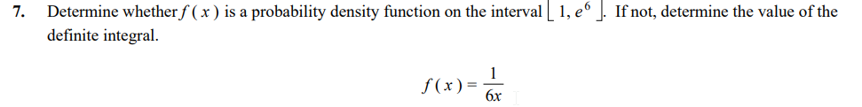

```{r setup, include=FALSE}
knitr::opts_chunk$set(echo = FALSE)
knitr::opts_chunk$set(tidy = TRUE)
knitr::opts_chunk$set(warning = FALSE)

loadPkg <- function(x) {
  if(!require(x, character.only = T)) install.packages(x, dependencies = T, repos = "http://cran.us.r-project.org")
  require(x, character.only = T)
}

libs <- c("knitr", "magrittr", "data.table", "kableExtra", "tidyverse", "matlib", "combinat", "leaps", "dummies")

lapply(libs, loadPkg)
```


$$
\int 4e^{-7x}dx \\
U = -7x \\
dU = -7dx \\
dx = \frac{dU}{-7} \\
4\int e^U\frac{dU}{-7} \\
\frac{4}{-7}\int e^UdU \\
\frac{4}{-7} e^U + C \\
\frac{4}{-7} e^{-7x} + C
$$




$$
\frac{dN}{dt} =\frac{3150}{t^4}-220 \\
dN = (\frac{3150}{t^4}-220)dt \\
N = \int \frac{3150}{t^4}dt-\int 220dt \\
N = N_0 - \frac{3150}{3t^3} - 220t \\
N = N_0 - \frac{3150}{3t^3} - 220t \\
N(1) = N_0 - \frac{1050}{1^3} - 220(1) \\
N_0 = 6530 + 1050 + 220 \\
N_0 = 7800 \\
N = 7800 - \frac{1050}{t^3} - 220t
$$




$$
A = \int_{4.5}^{8.5} 2x-9 dx \\
A = [x^2 - 9x]|_{4.5}^{8.5} \\
A = [8.5^2-9*8.5]-[4.5^2-9*4.5] \\
A = 16
$$





$$
y = x^2 -2x-2 \\
y =x+2 \\
A = \int_{-1}^{4}x+2 dx -\int_{-1}^{4}x^2 -2x-2 dx\\
A = \frac{1}{2}x^2|_{-1}^{4} +2x|_{-1}^{4} -[\frac{1}{3}x^3 - x^2 -2x]|_{-1}^{4} \\
A = -[\frac{1}{3}x^3 - \frac{3}{2}x^2 -4x]|_{-1}^{4} \\
A = [\frac{3}{2}x^2 +4x -\frac{1}{3}x^3]|_{-1}^{4}
$$

```{r}
((3/2)*4^2 +4*4 -(1/3)*4^3) - ((3/2)*(-1)^2 +4*(-1) -(1/3)*(-1)^3)
```




$$
C = 8.25r + \frac{3.75x}{2} \\
C = 8.25r+\frac{206.25}{r} \\
C' = 8.25 - \frac{206.25}{r^2} \\
C' = 0 \\
r = \sqrt{\frac{206.25}{8.25}}\\
$$

5 Orders per Year




$$
\int ln(9x)*x^6dx \\
U = ln(9x) \\
dU = \frac{1}{x}dx \\
dV = x^6dx \\
V = \frac{1}{7}x^7 \\
\int UdV = UV - \int VdU \\
\frac{1}{7}ln(9x)x^7 - \frac{1}{7}\int x^6dx \\
\frac{1}{7}x^7[ln(9x) - \frac{1}{7}]
$$




$$
F(x) = \int_{1}^{e^6} f(x)dx = 1 \\
f(x) = \frac{1}{6x} \\
F(x) = \int_{1}^{e^6} \frac{1}{6x}dx \\
F(x) = \frac{1}{6} \int_{1}^{e^6} \frac{1}{x}dx \\
F(x) = \frac{1}{6} ln(x)|_1^{e^6} \\
F(x) = \frac{1}{6} [ln(e^6) - ln(1)] \\
F(x) = \frac{1}{6} [6-0] = 1
$$