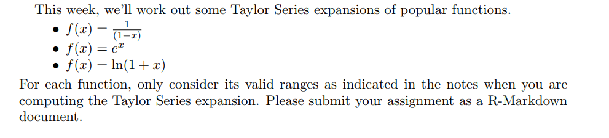

```{r setup, include=FALSE}
knitr::opts_chunk$set(echo = FALSE)
knitr::opts_chunk$set(tidy = TRUE)
knitr::opts_chunk$set(warning = FALSE)

loadPkg <- function(x) {
  if(!require(x, character.only = T)) install.packages(x, dependencies = T, repos = "http://cran.us.r-project.org")
  require(x, character.only = T)
}

libs <- c("knitr", "magrittr", "data.table", "kableExtra", "tidyverse", "matlib", "combinat", "leaps", "dummies", "rootSolve", "pracma")

lapply(libs, loadPkg)
```

## HW



```{r}
f <- function(x) {
  return(1/(1 - x))
}

g <- function(x) {
  return(exp(x))
}

h <- function(x) {
  return(log(1 + x))
}
```

```{r}
data_frame(f = taylor(f, 0, 5), g = taylor(g, 0, 5), h = taylor(h, 0, 5))

```

