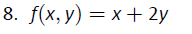

```{r setup, include=FALSE}
knitr::opts_chunk$set(echo = FALSE)
knitr::opts_chunk$set(tidy = TRUE)
knitr::opts_chunk$set(warning = FALSE)

loadPkg <- function(x) {
  if(!require(x, character.only = T)) install.packages(x, dependencies = T, repos = "http://cran.us.r-project.org")
  require(x, character.only = T)
}

libs <- c("knitr", "magrittr", "data.table", "kableExtra", "tidyverse", "matlib", "combinat", "leaps", "dummies", "rootSolve")

lapply(libs, loadPkg)
```

## Question 12.1.8



```{r}
twelve.1.8 <- function(x, y) {
  return(x + (2 * y))
}

data <- data_frame(x = -100:100, y = -100:100, fxy = twelve.1.8(x, y)) %>%
  print
```

$$
Domain = (-\infty, \infty)
$$
$$
Range = (-\infty, \infty)
$$