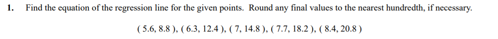
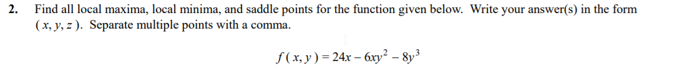
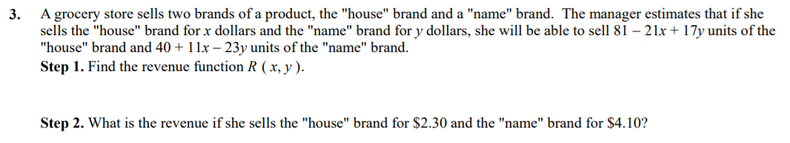
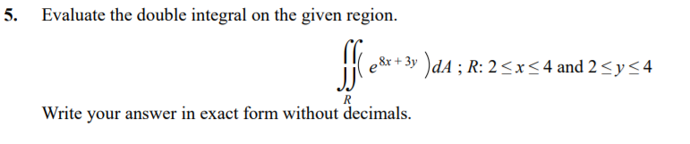

```{r setup, include=FALSE}
knitr::opts_chunk$set(echo = FALSE)
knitr::opts_chunk$set(tidy = TRUE)
knitr::opts_chunk$set(warning = FALSE)

loadPkg <- function(x) {
  if(!require(x, character.only = T)) install.packages(x, dependencies = T, repos = "http://cran.us.r-project.org")
  require(x, character.only = T)
}

libs <- c("knitr", "magrittr", "data.table", "kableExtra", "tidyverse", "matlib", "combinat", "leaps", "dummies", "rootSolve", "Deriv", "pracma")

lapply(libs, loadPkg)
```

## Question 1


```{r}
d1 <- data.frame(x = c(5.6, 6.3, 7, 7.7, 8.4), y = c(8.8, 12.4, 14.8, 18.2, 20.8))
m1 <- lm(y ~ x, data=d1)
summary(m1)

ggplot(d1, aes(x, y)) +
  geom_point(color = "blue", size = 3) +
  geom_abline(aes(slope = coef(m1)[2], intercept = coef(m1)[1]))
```

Equation: $y = -14.8 + 4.46x $


## Question 2


```{r}
fxy <- function(x, y) 24*x - 6*x*y^2 - 8*y^3
fp.x <- Deriv(fxy, c('x'))
fp.y <- Deriv(fxy, c('y'))

Deriv(fxy, c('x', 'y'))
```


$$
24 - 6y^2 = 0 \\
6y^2 = 24 \\
y^2 = 4 \\
y = \pm2
$$

$$
-12xy - 24y^2 = 0 \\
-12xy = 24y^2 \\
x = -2y
$$

For y = 2, x = -4
For y = -2, x = 4

Substite in the original function to find critical points:
```{r}
fxy(-4, 2)
fxy(4, -2)

results <- data_frame(x = c(-4, 4), y = c(2, -2), z = fxy(x, y)) %>%
  print
```

Saddle Points (Inflection Points)
```{r}
fp.x2 <- Deriv(fp.x, c('x'))
fp.y2 <- Deriv(fp.y, c('y'))
fp.xy <- Deriv(fp.x, c('y'))

D2 <- function(x, y, f1, f2, f3) {
  return(f1(x, y) * f2(x, y) - f3(x, y))
}

results %>%
  mutate(fp.x2 = fp.x2(x, y),
         fp.y2 = fp.y2(x, y),
         fp.xy = fp.xy(x, y),
         D2 = fp.x2 * fp.y2 - fp.xy)
```

There are two inflection points, one is positive at D(-4,2) and the other is negative at D(4,-2)

## Question 3


$$
Rev = price * units sold \\
R_1(x) = x * (81 - 21x + 17y) = (81x -21x^2 + 17xy) \\
R_2(y) = y * (40 + 11x -23y) = (40y + 11xy = 23y^2)
$$
Total Revenue
$$
R(x,y) = 81x - 21x^2 + 17xy + 40y + 11xy -23y^2 \\
R(x,y) = -21x^2 + 28xy - 23y^2 + 81x +40y
$$

```{r}
r.xy <- function(x, y) -21*x^2 + 28*x*y - 23*y^2 + 81*x + 40*y

r.xy(2.3, 4.1)
```


## Question 4


$$
C(x,y) = \frac{1}{6}x^2 + \frac{1}{6}y^2 + 7x + 25y + 700 \\
x + y = 96 \\
\\
C(96 - y, y) = \frac{1}{6}(96 - y)^2 + \frac{1}{2}y^2 + 7(96 - y) + 25y + 700 \\
C(96 - y, y) = \frac{1}{3}y^2 - 14y + 2908

$$

Minimum Value
```{r}
c.xy <- function(y) 1/3*y^2 - 14*y + 2908
cp.xy <- Deriv(c.xy, c('y'))
```

$$
\frac{2}{3}y - 14 = 0 \\
y = 21
\\
x = 96 - 21 \\
x = 75
$$
The company needs to produce 75 units in LA and 21 in Denver to minimize cost

## Question 5

```{r}
q5 <- function(x, y) exp(8*x + 3*y)
integral2(q5, 2, 4, 2, 4)
```

