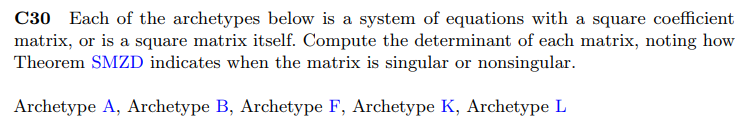
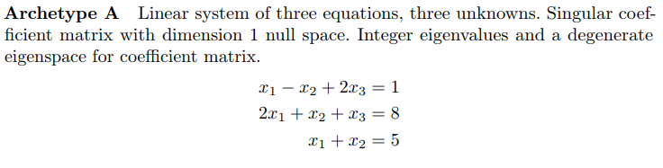
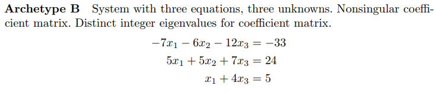
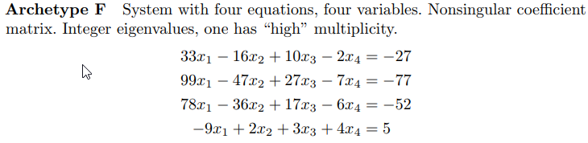
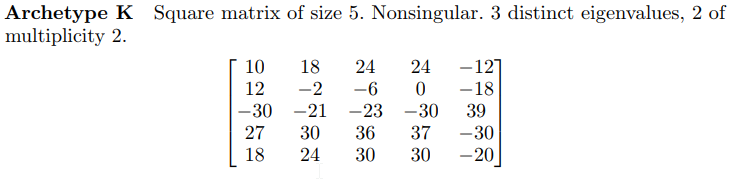
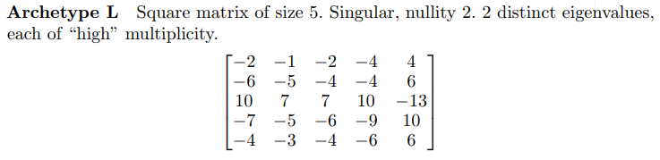

```{r setup, include=FALSE}
knitr::opts_chunk$set(echo = FALSE)
knitr::opts_chunk$set(tidy = TRUE)
knitr::opts_chunk$set(warning = FALSE)

loadPkg <- function(x) {
  if(!require(x, character.only = T)) install.packages(x, dependencies = T, repos = "http://cran.us.r-project.org")
  require(x, character.only = T)
}

libs <- c("knitr", "magrittr", "data.table", "kableExtra", "tidyverse", "matlib")

lapply(libs, loadPkg)
```


## C30





```{r}
A <- matrix(c(1,2,1,-1,1,1,2,1,0), nrow=3)
det(A)
```



```{r}
B <- matrix(c(-7,5,1,-6,5,0,-12,7,4), nrow=3)
det(B)
```



```{r}
F <- matrix(c(33,99,78,-9,-16,-47,-36,2,10,27,17,3,-2,-7,-6,4), nrow=4)
det(F)
```



```{r}
K <- matrix(c(10,12,-30,27,18,18,-2,-21,30,24,24,-6,-23,36,30,24,0,-30,37,30,-12,-18,39,-30,-20), nrow=5)
det(K)
```



```{r}
L <- matrix(c(-2,-6,10,-7,-4,-1,-5,7,-5,-3,-2,-4,7,-6,-4,-4,-4,10,-9,-6,4,6,-13,10,6), nrow=5)
det(L)

```


```{r}
data_frame(determinant = c(det(A), det(B), det(F), det(K), det(L))) %>%
  mutate(singular = determinant == 0)
```

