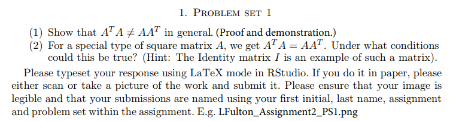

```{r setup, include=FALSE}
knitr::opts_chunk$set(echo = FALSE)
knitr::opts_chunk$set(tidy = TRUE)
knitr::opts_chunk$set(warning = FALSE)

loadPkg <- function(x) {
  if(!require(x, character.only = T)) install.packages(x, dependencies = T, repos = "http://cran.us.r-project.org")
  require(x, character.only = T)
}

libs <- c("knitr", "magrittr", "data.table", "kableExtra", "tidyverse", "matlib")

lapply(libs, loadPkg)
```


### Problem Set 1


1)
```{r}
A = matrix(seq(1, 9), nrow=3, byrow = T)
AT = matrix(seq(1, 9), nrow=3, byrow = F)
```

$$\left[\begin{array}
{rrr}
1 & 2 & 3 \\
4 & 5 & 6 \\
7 & 8 & 9
\end{array}\right] *
\left[\begin{array}
{rrr}
1 & 4 & 7 \\
2 & 5 & 8 \\
3 & 6 & 9
\end{array}\right] =
$$

```{r}
A %*% AT
```

$$
\left[\begin{array}
{rrr}
1 & 4 & 7 \\
2 & 5 & 8 \\
3 & 6 & 9
\end{array}\right] *
\left[\begin{array}
{rrr}
1 & 2 & 3 \\
4 & 5 & 6 \\
7 & 8 & 9
\end{array}\right] =
$$

```{r}
AT %*% A
```

```{r}
(AT %*% A) == (A %*% AT)
```


2) An identity matrix when transposed and multiplied to itself, are equal to each other
```{r}
A = matrix(c(1, 0, 0, 1), nrow=2, byrow = T)
AT = t(A)

(A %*% AT) == (A %*% AT)
```

### Problem Set 2
```{r}
luSolve <- function(m) {
  mDims <- dim(m)
  
  # check for square matrix
  if (mDims[1] != mDims[2]) return(NA)
  
  U <- m
  n <- mDims[1]
  L <- diag(n)
  
  # if dim is 1, the U=A and L=[1]
  if (n == 1) return(list(L, U))
  
  # loop through lower triangle
  # determine multiplier
  for(i in 2:n) {
    for(j in 1:(i - 1)) {
      multiplier <- -U[i, j] / U[j, j]
      U[i, ] <- multiplier * U[j, ] + U[i, ]
      L[i, j] <- -multiplier
    }
  }
  
  return(list(L,U))
}
```

Demonstrations
```{r}
m1 <- matrix(seq(1, 9), nrow = 3)
m2 <- matrix(sample(1:100, 9, replace=T), nrow = 3)

ms <- list(m1, m2)

lus <- ms %>%
  map(luSolve) %>%
  print

m1 == lus[[1]][[1]] %*% lus[[1]][[2]]
m2 == lus[[2]][[1]] %*% lus[[2]][[2]]
```


