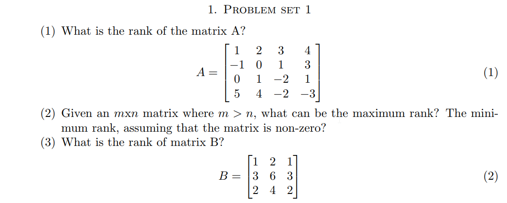
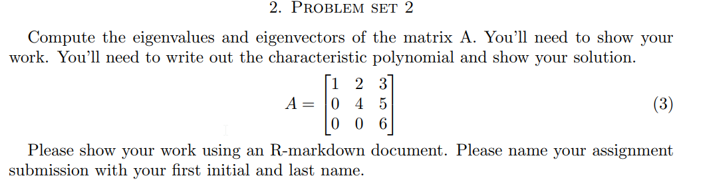

```{r setup, include=FALSE}
knitr::opts_chunk$set(echo = FALSE)
knitr::opts_chunk$set(tidy = TRUE)
knitr::opts_chunk$set(warning = FALSE)

loadPkg <- function(x) {
  if(!require(x, character.only = T)) install.packages(x, dependencies = T, repos = "http://cran.us.r-project.org")
  require(x, character.only = T)
}

libs <- c("knitr", "magrittr", "data.table", "kableExtra", "tidyverse", "matlib", "pracma")

lapply(libs, loadPkg)
```


## Q1


1)
```{r}
A = matrix(c(1, -1, 0, 5, 2, 0, 1, 4, 3, 1, -2, -2, 4, 3, 1, -3), nrow=4, byrow = F)

# rank of A
qr(A)$rank
```

2)
The maximum rank of a matrix where *m > n* cannot be larger than the *min(m, n)*. The minimum rank of any matrix outside of a zero matrix is 1.

3)
```{r}
B = matrix(c(1, 3, 2, 2, 6, 4, 1, 3, 2), nrow=3, byrow=F)

# rank of B
qr(B)$rank
```


## Q2

```{r}
A = matrix(c(1, 0, 0, 2, 4, 0, 3, 5, 6), nrow=3, byrow=F)

# find eigen values
eigen(A)$values

# find eigen vectors
eigen(A)$vectors
```

The **characteristic polynomial** is:
$p_{A}(\lambda) = (1 - \lambda)(4 - \lambda)(6 - \lambda)$

The **eigenspace** when $\lambda = 1$ is:
```{r}
rref(A - 1 * diag(3))
```

$$
\left[\begin{array}
{rrr}
0 & 1 & 0 \\
0 & 0 & 1 \\
0 & 0 & 0
\end{array}\right]
\left[\begin{array}
{rrr}
v_{1} \\
v_{2} \\
v_{3} 
\end{array}\right] =
\left[\begin{array}
{rrr}
0  \\
0  \\
0
\end{array}\right]
$$

Therefore

$$
E_{\lambda=1} = \left[\begin{array}
{rrr}
1 \\
0 \\
0 
\end{array}\right]
$$

The **eigenspace** when $\lambda = 4$ is:
```{r}
rref(A - 4 * diag(3))
```

$$
\left[\begin{array}
{rrr}
1 & -\frac{2}{3} & 0 \\
0 & 0 & 1 \\
0 & 0 & 0
\end{array}\right]
\left[\begin{array}
{rrr}
v_{1} \\
v_{2} \\
v_{3} 
\end{array}\right] =
\left[\begin{array}
{rrr}
0  \\
0  \\
0
\end{array}\right]
$$

Therefore

$$
E_{\lambda=4} = \left[\begin{array}
{rrr}
1 \\
1.5 \\
0 
\end{array}\right]
$$

The **eigenspace** when $\lambda = 6$ is:
```{r}
rref(A - 6 * diag(3))
```

$$
\left[\begin{array}
{rrr}
1 & 0 & -1.6 \\
0 & 1 & -2.5 \\
0 & 0 & 0
\end{array}\right]
\left[\begin{array}
{rrr}
v_{1} \\
v_{2} \\
v_{3} 
\end{array}\right] =
\left[\begin{array}
{rrr}
0  \\
0  \\
0
\end{array}\right]
$$

Therefore

$$
E_{\lambda=6} = \left[\begin{array}
{rrr}
1.6 \\
2.5 \\
1 
\end{array}\right]
$$