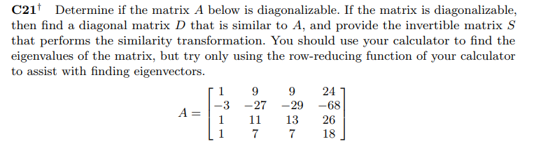

```{r setup, include=FALSE}
knitr::opts_chunk$set(echo = FALSE)
knitr::opts_chunk$set(tidy = TRUE)
knitr::opts_chunk$set(warning = FALSE)

loadPkg <- function(x) {
  if(!require(x, character.only = T)) install.packages(x, dependencies = T, repos = "http://cran.us.r-project.org")
  require(x, character.only = T)
}

libs <- c("knitr", "magrittr", "data.table", "kableExtra", "tidyverse", "matlib")

lapply(libs, loadPkg)
```


## C21


```{r}
m <- matrix(c(1, 9, 9, 24, -3, -27, -29, -68, 1, 11, 13, 26, 1, 7, 7, 18), nrow=4, byrow=T)

# eigen list
e <- eigen(m)
e.vec <- e$vectors
e.val <- e$values

# diagonal
d <- diag(e.val)

# test if matrix is diagonalizable
(e.vec %*% d %*% solve(e.vec)) == m
```

Since the matrix is not diagonalizable, the invertible matrix cannot be found