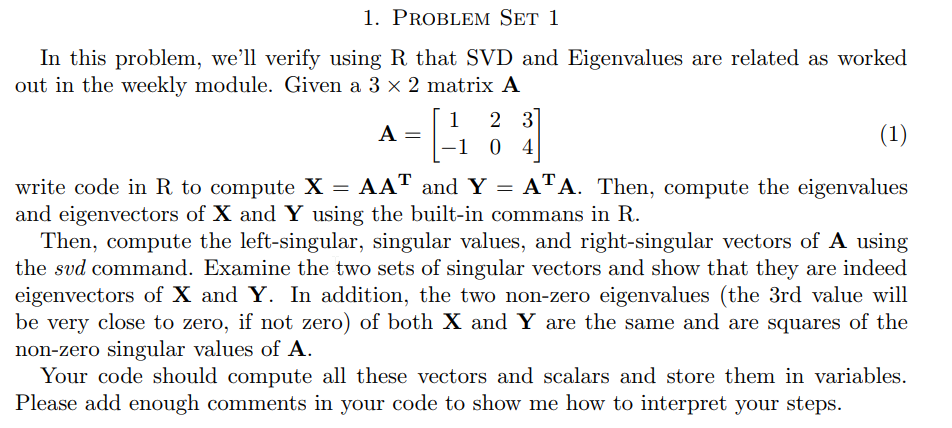
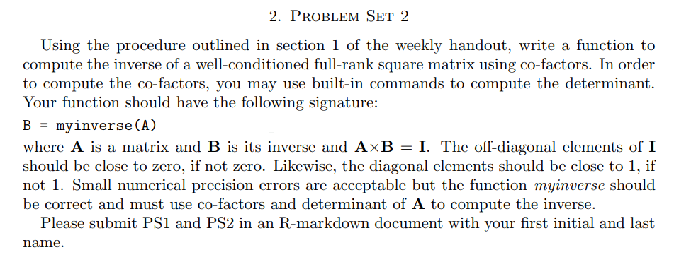

```{r setup, include=FALSE}
knitr::opts_chunk$set(echo = FALSE)
knitr::opts_chunk$set(tidy = TRUE)
knitr::opts_chunk$set(warning = FALSE)

loadPkg <- function(x) {
  if(!require(x, character.only = T)) install.packages(x, dependencies = T, repos = "http://cran.us.r-project.org")
  require(x, character.only = T)
}

libs <- c("knitr", "magrittr", "data.table", "kableExtra", "tidyverse", "matlib", "pracma")

lapply(libs, loadPkg)
```


## Q1


```{r}
A <- matrix(c(1,-1,2,0,3,4), nrow = 2, byrow = F)
```

### Find X
```{r}
X <- (A %*% t(A)) %>%
  print
```

### Find Y
```{r}
Y <- (t(A) %*% A) %>%
  print
```

### Eigenvalues & Eigenvectors
```{r}
eX <- eigen(X) %>%
  print

eY <- eigen(Y) %>%
  print
```

### Left-Singular, Singular, Right-Singular Values
```{r}
svd.A <- svd(A)

# left
round(svd.A$u[,1], 4) == (round(eX$vectors[,1] * -1, 4))


# right
round(svd.A$v[,1], 4) == (round(eY$vectors[,1] * -1, 4))
```

This comparison provies that the first columns of the eigenvectors and their respective singular columns are exactly the same except multiplied by -1.

### Non-Singular Values
```{r}
round(sqrt(eX$values), 4) == round(svd.A$d, 4)
```

This shows that both X and Y are the same and are the squares of the non-zero singular values of A


## Q2



```{r}
A <- matrix(c(1,2,4,2,-1,3,4,0,1), nrow=3, byrow = T)
solve(A)
```

### Inverse Function
```{r}
myinverse <- function(A) {
  # dimensions
  dimA <- dim(A)
  
  # validation
  if (dimA[1] != dimA[2]) return(NA)
  if (det(A) == 0) return(NA)
  
  # empty matrix
  C <- diag(1, nrow(A), ncol(A))
  
  # compute cofactor matrix C
  for (i in 1:nrow(A)) {
    for (j in 1:ncol(A)) {
      aij <- A[-i, -j]
      C[i, j] <- ((-1)^(i + j)) * det(aij)
    }
  }
  
  return(t(C)/det(A))
}
```

### Check
```{r}
round(myinverse(A), 4) == round(solve(A), 4)
```

