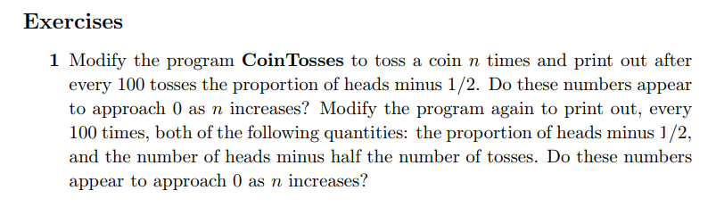

```{r setup, include=FALSE}
knitr::opts_chunk$set(echo = FALSE)
knitr::opts_chunk$set(tidy = TRUE)
knitr::opts_chunk$set(warning = FALSE)

loadPkg <- function(x) {
  if(!require(x, character.only = T)) install.packages(x, dependencies = T, repos = "http://cran.us.r-project.org")
  require(x, character.only = T)
}

libs <- c("knitr", "magrittr", "data.table", "kableExtra", "tidyverse", "matlib")

lapply(libs, loadPkg)
```

## Question 1


```{r}
flips <- c(100,200,400,800,1600,3200, 6400, 12800, 35600)

coinTossProgram <- function(n) {
  flips <- rbinom(n, size = 1, prob = .5)
  return((sum(flips)/length(flips)) - .5)
}

flips %>%
  map(coinTossProgram)
```

From the results, as n increases, the results approch closer and closer to 0.

```{r}
coinTossProgram2 <- function(n) {
  flips <- rbinom(n, size = 1, prob = .5)
  return(
    list(
      (sum(flips)/length(flips)) - .5,
      sum(flips) - (length(flips)/2)
    )
  )
}

flips %>%
  map(coinTossProgram2)
```

The first number still approaches zero, but the second number does not.
