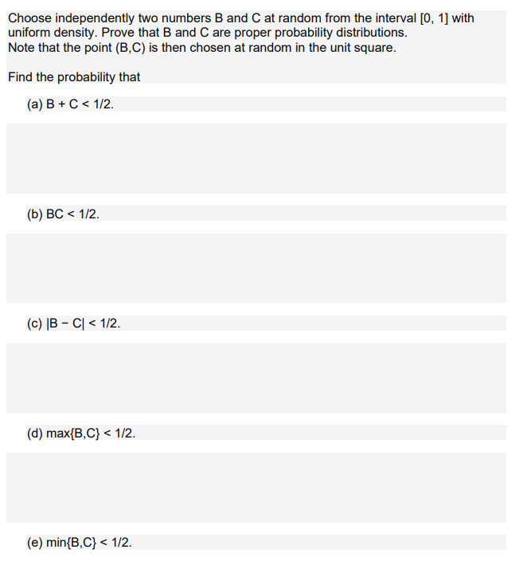

```{r setup, include=FALSE}
knitr::opts_chunk$set(echo = FALSE)
knitr::opts_chunk$set(tidy = TRUE)
knitr::opts_chunk$set(warning = FALSE)

loadPkg <- function(x) {
  if(!require(x, character.only = T)) install.packages(x, dependencies = T, repos = "http://cran.us.r-project.org")
  require(x, character.only = T)
}

libs <- c("knitr", "magrittr", "data.table", "kableExtra", "tidyverse", "matlib")

lapply(libs, loadPkg)
```

## Question 1



```{r}
B <- runif(10000, 0, 1)
C <- runif(10000, 0, 1)
```

a.)
```{r}
sum((B+C) < .5)/length(B + C)
```

b.)
```{r}
sum((B*C) < .5)/length(B*C)
```

c.)
```{r}
sum(abs(B-C) < .5)/length(abs(B-C))
```

d.)
```{r}
d <- map2_dbl(B, C, max)
sum(d < .5)/length(d)
```


e.)
```{r}
e <- map2_dbl(B, C, min)
sum(e < .5)/length(e)
```

