```{r setup, include=FALSE}
knitr::opts_chunk$set(echo = FALSE)
knitr::opts_chunk$set(tidy = TRUE)
knitr::opts_chunk$set(warning = FALSE)

loadPkg <- function(x) {
  if(!require(x, character.only = T)) install.packages(x, dependencies = T, repos = "http://cran.us.r-project.org")
  require(x, character.only = T)
}

libs <- c("knitr", "magrittr", "data.table", "kableExtra", "tidyverse", "matlib", "combinat")

lapply(libs, loadPkg)
```

### 1
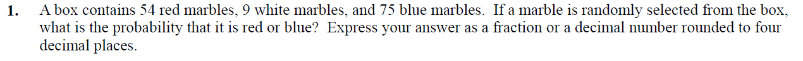

This question is a simple combination since order does not matter for randomly choosing 5 people to form a committee

```{r}
round((54+75)/(54+9+75), 4)
```


### 2
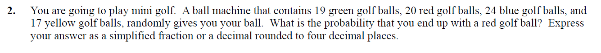
```{r}
20/sum(19, 20, 24, 17)
```


### 3
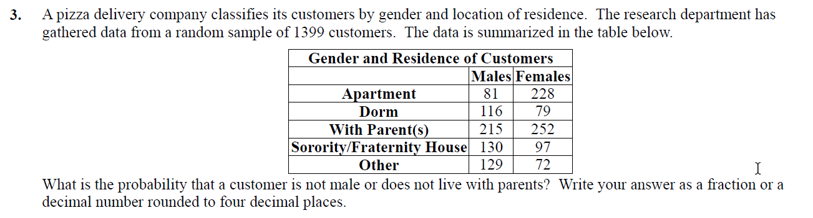

```{r}
d3 <- data_frame(place = c('apartment', 'dorm', 'parents', 's/f house', 'other'),
                 m = c(81, 116, 215, 130, 129),
                 f = c(228, 79, 252, 97, 72)) %>%
  mutate(prob.m = m/sum(m),
         prob.f = f/sum(f))

total <- d3 %>%
  select(m, f) %>%
  sum

not.male <- d3 %>%
  select(f) %>%
  sum %>%
  divide_by(total)

no.parents <- d3 %>%
  filter(place != 'parents') %>%
  select(m, f) %>%
  sum %>%
  divide_by(total)

overlap <- d3 %>%
  filter(place != 'parents') %>%
  select(f) %>%
  sum %>%
  divide_by(total)

round(not.male + no.parents - overlap, 4)
```


### 4
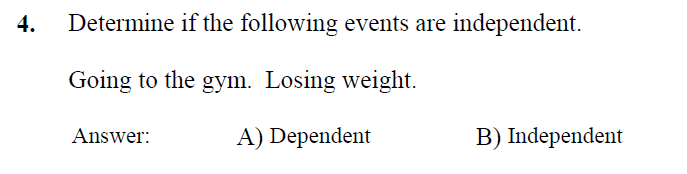

Going to the gym is independent of losing weight because one can go to the gym and not lose weight at all, or someone can lose weight without going to the gym at all.


### 5
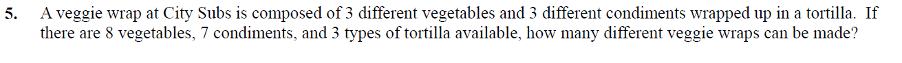

```{r}
v.combos <- dim(combn(8, 3))[2]
c.combos <- dim(combn(7, 3))[2]
t.combos <- dim(combn(3, 1))[2]

v.combos * c.combos * t.combos
```


### 6
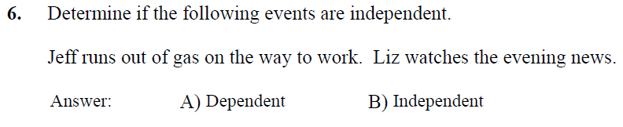

These events are independent because there is no causation between the two events


### 7
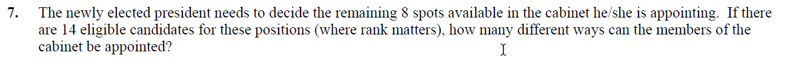

```{r}
nPr <- function(n, r) factorial(n)/(factorial(n - r))

nPr(14, 8)
```


### 8
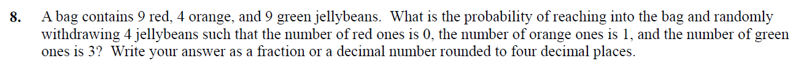

```{r}
red <- 9
orange <- 4
green <- 9
total <- sum(red, orange, green)

r <- factorial(red)/(factorial(red-0)*factorial(0))
o <- factorial(orange)/(factorial(orange - 1) * factorial(1))
g <- factorial(green)/(factorial(green - 3) * factorial(3))
t <- factorial(total)/(factorial(total - 4) * factorial(4))

round((r*o*g)/t, 4)
```


### 9
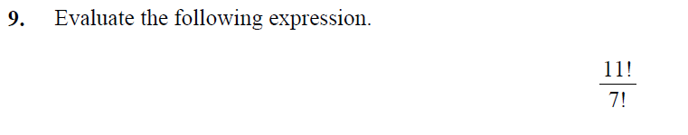

```{r}
factorial(11)/factorial(7)
```


### 10
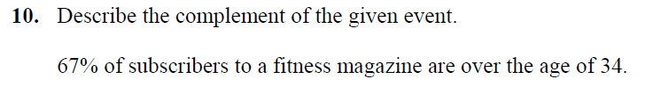

33% of subscribers to a fitness magazine are under the age of 34.


### 11
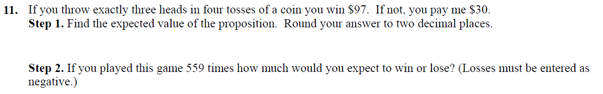

1.

```{r}
total <- 2^4

d11 <- data_frame(heads = 0:4) %>%
  mutate(prob = (factorial(4)/(factorial(4 - heads) * factorial(heads)))/total,
         winnings = c(-30, -30, -30, 97, -30))

sum(d11$prob * d11$winnings)
```

2.
```{r}
559 * sum(d11$prob * d11$winnings)
```


### 12
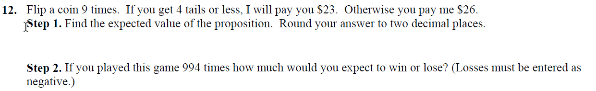

1. The expected payout is:

```{r}
prob <- pbinom(4, 9, .5)

ep <- ((23*prob) - (26*prob)) %>%
  print
```

2. Over 994 games, the gambler should expect to lose:
```{r}
ep * 994
```


### 13
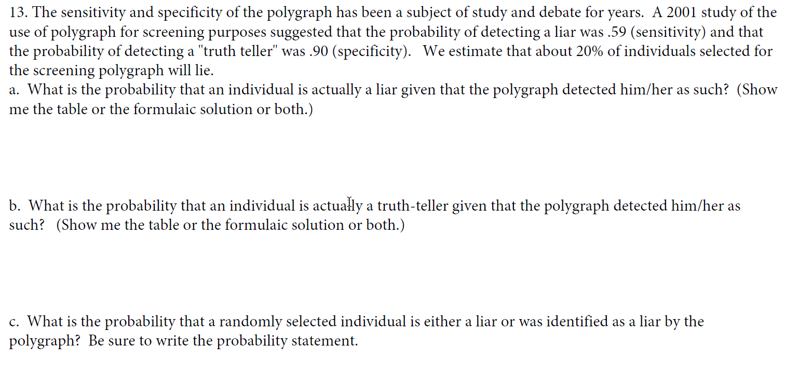

a. The probability that an individual is actually a liar given a positive lie detection
```{r}
liar <- .59
truth_teller <- .9
percent_will_lie <- .2

pLiarGivenLie <- (liar * percent_will_lie)/(((1 - percent_will_lie) * (1 - truth_teller)) + (percent_will_lie * liar))

round(pLiarGivenLie, 4)
```

b. The probability that an individual is actually a truth teller given a negative lie detection
```{r}
pTruthGivenTruth <- (truth_teller * (1 - percent_will_lie))/(((1 - liar) * (percent_will_lie)) + (truth_teller * (1 -percent_will_lie)))

round(pTruthGivenTruth, 4)
```


c. The probability that an individual is a liar or was identified as a liar
```{r}
round((liar + percent_will_lie) - pLiarGivenLie, 4)
```

