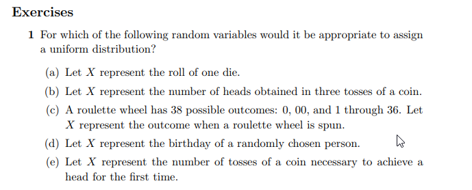

```{r setup, include=FALSE}
knitr::opts_chunk$set(echo = FALSE)
knitr::opts_chunk$set(tidy = TRUE)
knitr::opts_chunk$set(warning = FALSE)

loadPkg <- function(x) {
  if(!require(x, character.only = T)) install.packages(x, dependencies = T, repos = "http://cran.us.r-project.org")
  require(x, character.only = T)
}

libs <- c("knitr", "magrittr", "data.table", "kableExtra", "tidyverse", "matlib", "combinat")

lapply(libs, loadPkg)
```

## Question 2


```{r}
d <- data_frame(x = c(-1, 0, 1, 2), y = c(1/4, 1/2, 1/8, 1/8))

s <- table(sample(d$x, size=1000, prob=d$y, replace=T)) %>%
  print
lbls = sprintf("%0.1f%%", s/sum(s) * 100)
barX <- barplot(s, ylim=c(0, 200))
text(x=barX, y=s+10, label=lbls)
```

