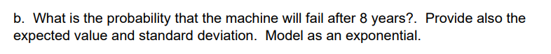

```{r setup, include=FALSE}
knitr::opts_chunk$set(echo = FALSE)
knitr::opts_chunk$set(tidy = TRUE)
knitr::opts_chunk$set(warning = FALSE)

loadPkg <- function(x) {
  if(!require(x, character.only = T)) install.packages(x, dependencies = T, repos = "http://cran.us.r-project.org")
  require(x, character.only = T)
}

libs <- c("knitr", "magrittr", "data.table", "kableExtra", "tidyverse", "matlib", "combinat")

lapply(libs, loadPkg)
```

### Question 1


Since the distribution is uniform, we know that the possibilities of $X$ is equal to $k^n$ and

$$1 = k^n - (k - 1)^n$$

Since $k^n$ is the total number of possibilities and $(k - 1)^n$ are the possibilities that aren't equal to 1, if Y is to equal any number $(Y = j)$, we get

$$For 1 \le j \le k, m(j) = \frac{(k - j + 1)^n - (j - k)^n}{k^n}$$
Answer adapted from: https://math.dartmouth.edu/archive/m20f10/public_html/HW5Solutions.pdf

### Question 2

```{r}
x = 8
n = 10
s = 1/n
o = s*x
q = 1 - s
```

#### a


Using a geometric distribution:

```{r}
p <- 1 - pgeom(x, s, lower.tail = F)
ex <- s*x
sd <- ex*q


data_frame(c('prob', 'mean', 'sd'), c(p, ex, sd))
```


#### b


Using an exponential distribution:
```{r}
p <- 1 - pexp(x, s, lower.tail = F)
ex <- 1/s
sd <- sqrt(1/(s^2))


data_frame(c('prob', 'mean', 'sd'), c(p, ex, sd))
```


#### c


Using a binomial distribution:
```{r}
p <- 1 - pbinom(0, size=x, prob=s)
ex <- x*s
sd <- sqrt(x*s*q)


data_frame(c('prob', 'mean', 'sd'), c(p, ex, sd))
```


#### d


Using a poisson distribution:
```{r}
p <- 1 - ppois(0, lambda = o)
ex <- x*s
sd <- sqrt(o)


data_frame(c('prob', 'mean', 'sd'), c(p, ex, sd))
```