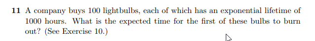
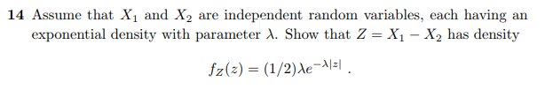
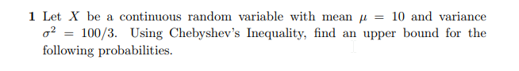
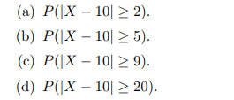

```{r setup, include=FALSE}
knitr::opts_chunk$set(echo = FALSE)
knitr::opts_chunk$set(tidy = TRUE)
knitr::opts_chunk$set(warning = FALSE)

loadPkg <- function(x) {
  if(!require(x, character.only = T)) install.packages(x, dependencies = T, repos = "http://cran.us.r-project.org")
  require(x, character.only = T)
}

libs <- c("knitr", "magrittr", "data.table", "kableExtra", "tidyverse", "matlib", "combinat")

lapply(libs, loadPkg)
```

### Question 11


The expected time for the first of these bulbs to burn out is:
```{r}
1000/100
```

This is simply the amount of expected lifetime hours divided by the bulbs.


### Question 14


For $X_2 \ge X_1$:

$$
f_Z(z) = \int_{-\infty}^{\infty}f_{X_1}(z+x_2)f_{X_2}(x_2)dx_2 \\
f_Z(z) = \int_{-\infty}^0\lambda e^{-\lambda (z+x_2)} \lambda e^{-\lambda x_2}dx_2 \\
f_Z(z) = \int_{-\infty}^0\lambda e^{-\lambda (z)} \lambda e^{-2\lambda x_2}dx_2  \\
f_Z(z) = \lambda^2 e^{-\lambda z}(\int_{-\infty}^0 e^{-2\lambda x_2}dx_2) \\
f_Z(z) = \lambda^2 e^{-\lambda z}(\frac{ -1}{2\lambda}) \\
f_Z(z) = \frac{-\lambda}{2} (e^{-\lambda z})
$$

For $X_1 \ge X_2$:

$$
f_Z(z) = \int_{-\infty}^{\infty}f_{X_1}(z+x_2)f_{X_2}(x_2)dx_2 \\
f_Z(z) = \int_0^{\infty}\lambda e^{-\lambda (z+x_2)} \lambda e^{-\lambda x_2}dx_2 \\
f_Z(z) = \int_0^{\infty}\lambda e^{-\lambda (z)} \lambda e^{-2\lambda x_2}dx_2  \\
f_Z(z) = \lambda^2 e^{-\lambda z}(\int_0^{\infty} e^{-2\lambda x_2}dx_2) \\
f_Z(z) = \lambda^2 e^{-\lambda z}(\frac{ -1}{2\lambda}) \\
f_Z(z) = \frac{\lambda}{2} (e^{-\lambda z})
$$

After combining the two:
$$
f(z) =
\begin{cases}
\frac{-\lambda}{2} (e^{-\lambda z}) & z < 0 \\
\frac{\lambda}{2} (e^{-\lambda z}) & z \geq 0
\end{cases}
$$

Which simplifies to:
$$
f(z) = \frac{\lambda}{2} e^{-\lambda |z|}
$$


### Question 1




#### a
$$
P(|X - 10| \geq 2) \leq \frac{\frac{100}{3}}{2^2}\\
P(|X - 10| \geq 2) \leq \frac{25}{3}
$$


#### b
$$
P(|X - 10| \geq 5) \leq \frac{\frac{100}{3}}{5^2}\\
P(|X - 10| \geq 5) \leq \frac{4}{3}
$$

#### c
$$
P(|X - 10| \geq 9) \leq \frac{\frac{100}{3}}{9^2}\\
P(|X - 10| \geq 9) \leq \frac{100}{243}
$$


#### d
$$
P(|X - 10| \geq 20) \leq \frac{\frac{100}{3}}{20^2}\\
P(|X - 10| \geq 20) \leq \frac{100}{1200}
$$
