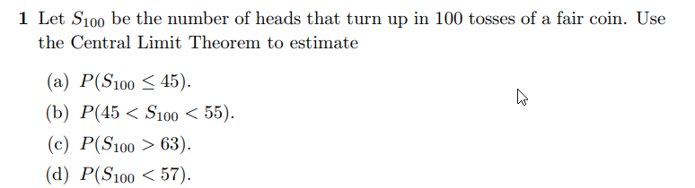

```{r setup, include=FALSE}
knitr::opts_chunk$set(echo = FALSE)
knitr::opts_chunk$set(tidy = TRUE)
knitr::opts_chunk$set(warning = FALSE)

loadPkg <- function(x) {
  if(!require(x, character.only = T)) install.packages(x, dependencies = T, repos = "http://cran.us.r-project.org")
  require(x, character.only = T)
}

libs <- c("knitr", "magrittr", "data.table", "kableExtra", "tidyverse", "matlib", "combinat")

lapply(libs, loadPkg)
```

## Question 1



a)
```{r}
n = 100
p = .5
q = 1 - p

var = n*p*q
sd = sqrt(var)

pnorm(45, mean = n*p, sd=sd)
```

b)
```{r}
pnorm(55, mean = n*p, sd=sd) - pnorm(45, mean = n*p, sd=sd)
```


c)
```{r}
pnorm(63, mean = n*p, sd=sd, lower.tail = F)
```


d)
```{r}
1 - pnorm(57, mean = n*p, sd=sd, lower.tail = F)
```


