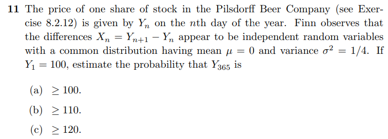
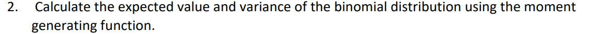
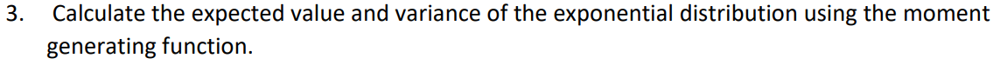

```{r setup, include=FALSE}
knitr::opts_chunk$set(echo = FALSE)
knitr::opts_chunk$set(tidy = TRUE)
knitr::opts_chunk$set(warning = FALSE)

loadPkg <- function(x) {
  if(!require(x, character.only = T)) install.packages(x, dependencies = T, repos = "http://cran.us.r-project.org")
  require(x, character.only = T)
}

libs <- c("knitr", "magrittr", "data.table", "kableExtra", "tidyverse", "matlib", "combinat")

lapply(libs, loadPkg)
```

## Question 11


```{r}
mu = 0
sd = sqrt(365 * 1/4)

ans <- c(100, 110, 120) %>%
  map_dbl(~ pnorm(.x - 100, mean = mu, sd = sd, lower.tail = F))

data_frame(qs = c('a', 'b', 'c'), ans = ans)
```


## Question 2


$$
g(t) = \sum_{j=0}^n e^{tj} {{n}\choose{j}}p^jq^{n-j} \\
g(t) = \sum_{j=0}^n {{n}\choose{j}}(pe^t)^jq^{n-j} \\
g(t) = (pe^t+q)^n \\

g'(t) = n(pe^t+q)^{n-1}pe^t \\
g''(t) = n(n-1)(pe^t+q)(pe^t)^2 + n(pe^t+q)^npe^t \\
g'(0) = n(p+q)^{n-1}p =np \\

g''(0) = n(n-1)(p+q)^{n-1}p^2 + n(p+q)^np \\
g''(0) = n(n-1)p^2 + np \\

\boxed{\mu = \mu_1 = g'(0) = np} \\

\sigma^2 = \mu_2-\mu_1^2 = g''(0) - g'(0)^2 \\
\sigma^2 = n(n-1)p^2 + np - (np)^2 \\
\sigma^2 = np[(n-1)p +1 -np] \\
\sigma^2 = np[(np-p) +1 -np] \\

\boxed{\sigma^2 = np[1-p]}
$$


## Question 3


$$
g(t) = \int_0^\infty e^{tx}\lambda e^{-\lambda x} dx \\
g(t) = \frac{\lambda e^{(t-\lambda )x}}{t -\lambda}|_0^{\infty} \\
g(t) = \frac{\lambda}{\lambda-t} \\

g'(t) = \frac{\lambda}{(\lambda-t)^2} \\
g'(0) = \frac{\lambda}{\lambda^2} = \frac{1}{\lambda} \\

g''(t) = \frac{2\lambda}{(\lambda-t)^3} \\
g''(0) =  \frac{2\lambda}{\lambda^3} = \frac{2}{\lambda^2}
$$